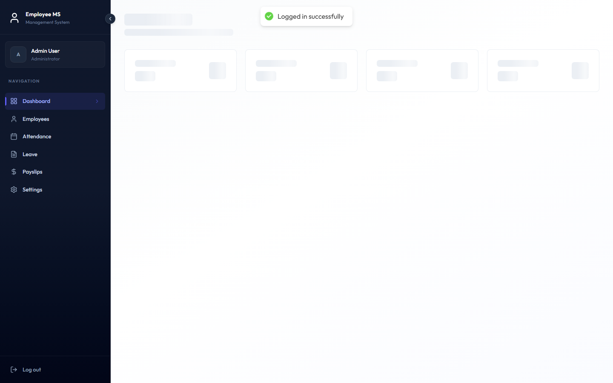
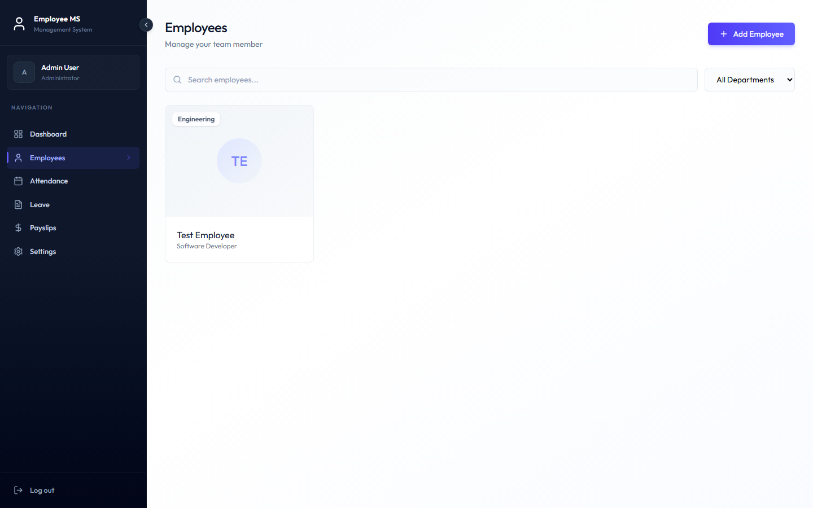
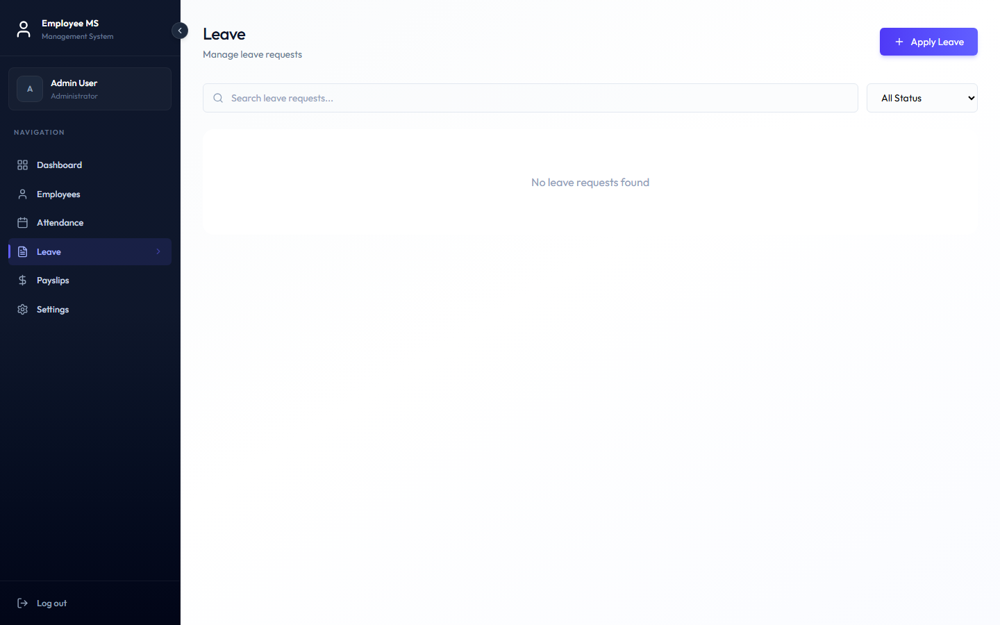
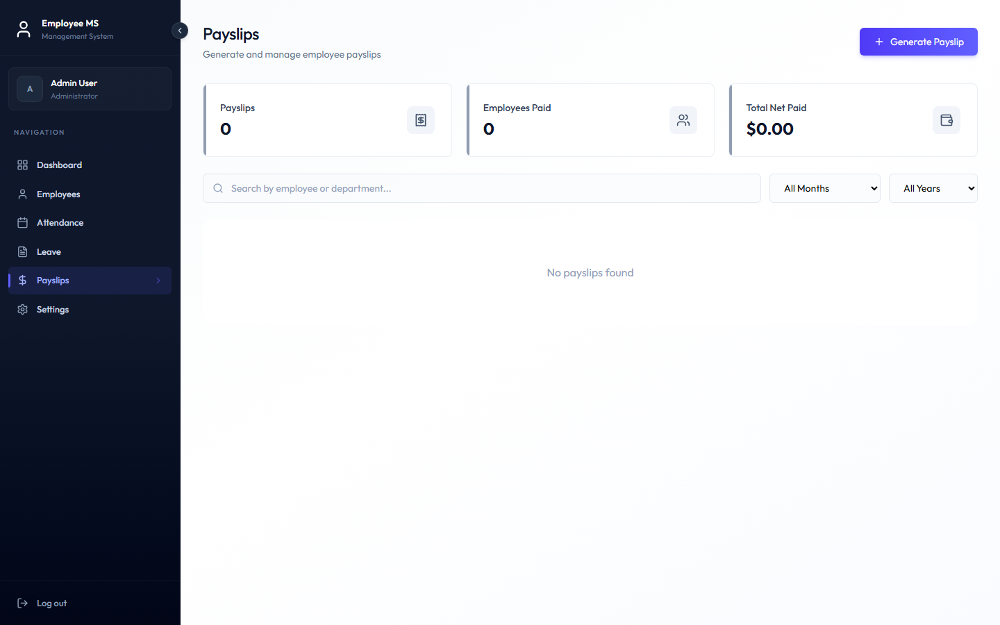
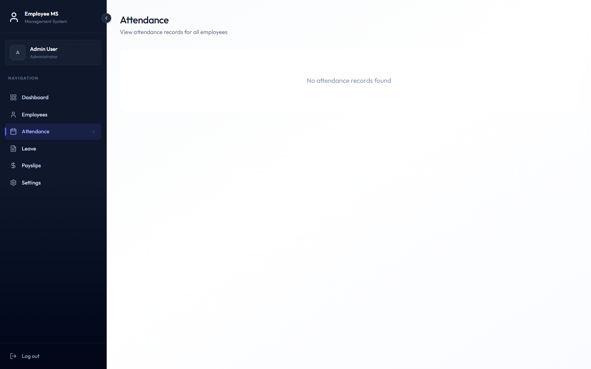
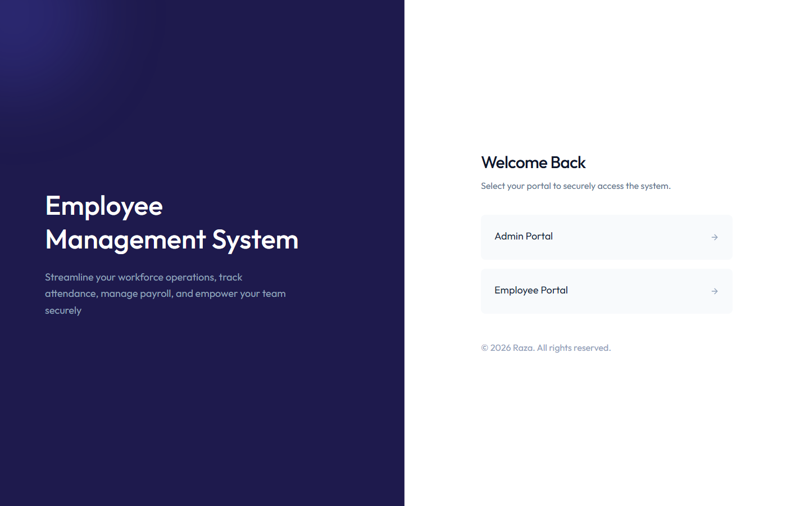

<div align="center">

# 🧑‍💼 Employee Management System

**A full-stack HR platform for managing employees, attendance, leave, and payroll — with separate Admin and Employee portals.**

[](https://react.dev/)
[](https://vitejs.dev/)
[](https://nestjs.com/)
[](https://www.mongodb.com/atlas)
[](https://tailwindcss.com/)
[](https://jwt.io/)

[](https://render.com)
[](https://vercel.com)
[](https://github.com/raza5500)

</div>

---

## 🔑 Try it yourself — test accounts

> Spin up the app (or use the live demo link once deployed) and log in with either of these — no signup needed.

| Portal | Email | Password | Notes |
|---|---|---|---|
| 🛡️ **Admin** | `admin@gmail.com` | `12345678` | Full access — manage employees, approve leave, run payroll |
| 👤 **Employee** | `employee@gmail.com` | `12345678` | Self-service — attendance, leave requests, payslips |

> ⚠️ The employee account uses a **one-time temporary password**. On first login you'll be prompted to set your own — that's an intentional security feature (see [Security](#-authentication--security)), not a bug.

🔗 **Live App:** [employee-management-system-react-steel.vercel.app](https://employee-management-system-react-steel.vercel.app)
🔗 **Live API:** [ems-backend-e8ie.onrender.com](https://ems-backend-e8ie.onrender.com)

---

## 📋 Table of Contents

- [Overview](#-overview)
- [Screenshots](#-screenshots)
- [Features](#-features)
- [Tech Stack](#-tech-stack)
- [Project Structure](#-project-structure)
- [Getting Started](#-getting-started)
- [Environment Variables](#-environment-variables)
- [API Overview](#-api-overview)
- [Authentication & Security](#-authentication--security)
- [Deployment](#-deployment)
- [Author](#-author)

---

## 🧭 Overview

Employee Management System (EMS) is a complete internal HR tool built as a **decoupled full-stack app**: a NestJS + MongoDB REST API on the backend, and a React + Vite SPA on the frontend. It models a real small-company workflow — an **Admin** who runs the organization (hiring, payroll, approvals) and **Employees** who use a self-service portal for their own day-to-day (clocking in, requesting time off, checking payslips).

Every workflow in the app is backed by real, validated API calls — there is no mock or dummy data anywhere in the client.

## 📸 Screenshots

| Dashboard | Employees |
|---|---|
|  |  |

| Leave Management | Payslips |
|---|---|
|  |  |

| Attendance | Login Portal |
|---|---|
|  |  |

## ✨ Features

### 🛡️ Admin

- 👥 **Employee management** — create, edit, delete employee records (each creation provisions a real linked login account with a temporary password)
- 📅 **Attendance oversight** — read-only view of every employee's daily check-in/check-out history
- 🗓️ **Leave approvals** — approve, reject, or reset the status of any leave request
- 💰 **Payroll** — generate, view, and delete monthly payslips per employee (with duplicate-period protection)
- 📊 **Dashboard** — live counts: total employees, departments, today's attendance, pending leave

### 👤 Employee

- ⏱️ **Attendance** — check in / check out for the day, view personal attendance history
- 🗓️ **Leave requests** — apply for leave, edit while still pending, track approval status
- 💵 **Payslips** — view and print your own generated payslips
- ⚙️ **Settings** — update profile info, change password
- 📊 **Dashboard** — personal stats: days present this month, pending leave, latest payslip

### 🔐 Platform-wide

- Two separate login portals (Admin / Employee) backed by one unified, role-based auth system
- Forced password reset for new employees on first login
- Fully responsive — collapsible desktop sidebar, mobile drawer navigation
- Toast notifications, inline validation, and graceful error handling throughout

## 🛠️ Tech Stack

**Frontend** (`client/`)
- React 19 + Vite
- React Router v7
- Tailwind CSS v4
- react-hot-toast, lucide-react

**Backend** (`server/`)
- NestJS 12 + Express
- MongoDB + Mongoose (via `@nestjs/mongoose`)
- JWT authentication (`@nestjs/jwt`) + `bcryptjs` password hashing
- `class-validator` / `class-transformer` for request validation
- Vitest for unit tests

**Infrastructure**
- MongoDB Atlas (database)
- Render (backend hosting)
- Vercel (frontend hosting)

## 📁 Project Structure

```
Employee-Management-System/
├── client/                 # React + Vite frontend
│   └── src/
│       ├── api/            # fetch wrapper / API client
│       ├── context/        # AuthContext (session, role, profile)
│       ├── components/     # SideBar, forms, cards, dialogs
│       └── pages/          # Dashboard, Employees, Leave, Payslips, Attendance, Settings
│
├── server/                 # NestJS backend
│   └── src/
│       ├── auth/           # login/register, JWT guard, roles guard
│       ├── user/           # base user accounts
│       ├── employee/       # employee profiles (linked to user accounts)
│       ├── leave/          # leave requests
│       ├── payslip/        # payroll
│       ├── attendance/     # check-in/check-out
│       └── dashboard/      # aggregated stats per role
│
└── docs/screenshots/       # README assets
```

## 🚀 Getting Started

### Prerequisites
- Node.js ≥ 20
- A MongoDB connection (local via Docker, or a free [MongoDB Atlas](https://www.mongodb.com/atlas) cluster)

### 1. Clone the repo

```bash
git clone https://github.com/raza5500/Employee-Management-System.git
cd Employee-Management-System
```

### 2. Backend setup

```bash
cd server
npm install
cp .env.example .env    # then fill in MONGO_URI and JWT_SECRET
npm run start:dev       # runs on http://localhost:3000
```

### 3. Frontend setup

```bash
cd client
npm install
npm run dev              # runs on http://localhost:5173
```

### 4. Create your first admin

The `/auth/register` endpoint is intentionally not linked from the UI — it's the one-time bootstrap for creating the first Admin account:

```bash
curl -X POST http://localhost:3000/auth/register \
  -H "Content-Type: application/json" \
  -d '{"fName":"Admin","lName":"User","email":"admin@example.com","password":"yourpassword"}'
```

From there, log into the Admin portal and use **Add Employee** to create every subsequent account — each one automatically gets a linked login with a temporary password.

## 🔧 Environment Variables

**`server/.env`**

| Variable | Description |
|---|---|
| `MONGO_URI` | MongoDB connection string (local or Atlas) |
| `JWT_SECRET` | Secret used to sign JWTs |

**`client/.env`** / **`client/.env.production`**

| Variable | Description |
|---|---|
| `BACKEND_URI` | Base URL of the backend API |

## 📡 API Overview

<details>
<summary>Click to expand endpoint list</summary>

| Group | Endpoints |
|---|---|
| **Auth** | `POST /auth/register`, `POST /auth/login`, `GET /auth/profile` |
| **Users** | `GET/PATCH /users/me`, full admin CRUD at `/users/:id` |
| **Employees** | `GET/POST /employees`, `GET /employees/me`, `GET/PATCH/DELETE /employees/:id` |
| **Leave** | `GET/POST /leaves`, `PATCH/DELETE /leaves/:id` |
| **Payslips** | `GET/POST /payslips`, `GET/DELETE /payslips/:id` |
| **Attendance** | `POST /attendance/check-in`, `POST /attendance/check-out`, `GET /attendance/me`, `GET /attendance` |
| **Dashboard** | `GET /dashboard` — returns role-appropriate stats |

</details>

## 🔒 Authentication & Security

- Stateless **JWT** auth; the token's role claim drives both frontend route guards and backend `RolesGuard` checks
- Passwords hashed with `bcryptjs`; changing a password requires the current one
- New employee accounts are provisioned with a temporary password and a `mustChangePassword` flag — the app blocks all navigation with a mandatory "set your password" modal until it's changed
- Ownership checks everywhere: employees can only ever see their own leave, payslip, and attendance records — never another employee's

## ☁️ Deployment

| Layer | Platform | Notes |
|---|---|---|
| Database | MongoDB Atlas | Free M0 cluster |
| Backend | Render | Build: `npm install && npm run build` · Start: `npm run start:prod` |
| Frontend | Vercel | Build: `npm run build` · Output: `dist/` |

## 👤 Author

Built by **Raza**

[](https://github.com/raza5500)

<div align="center">

If you found this useful, consider giving it a ⭐ on GitHub!

</div>
